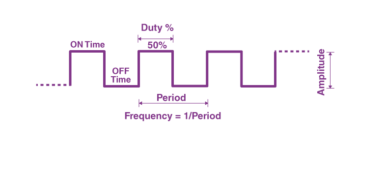

# 1 Meter Square Lap Robot

### Objective
The purpose of this mini project is to use Milis and PWM to control the movement of the robot and make it go in a 1 meter square lap.
### Circuit

### Parts
- Arduino Leonardo (You can use any. Just reference your SDA SCL and PWM pins from its datasheet)
- H-Bridge Driver : L298N
- MPU 6050
- 12 V Battery 

### Overview
Let's take a brief overview of how everything works:
- ##### Pulse Width Modulation
    A pulse width modulated output signal is one that has a period and an output “on time”, or duty cycle, within that period.
    

    The Duty Cycle denotes the percentage of time when the signal is on in 1 period. This effectively controls or "modulates" the speed of our motors.

    In <b>Arduino</b>, PWM is controlled by specified pins marked as ~ on the board. You can use PWM through analogWrite(PIN, DutyCycle). The Duty Cycle ranges from <b>0 to 255 </b> since its an 8 bit register.

    For example, if you want 50 % Duty Cycle you can write analogWrite(PIN, 127) or for 20% Duty Cycle it would be analogWrite(PIN, 51)

- ##### L298N H Bridge

    

    The left and right blue dual slot headers are for your motors.
    The blue three slot one is where you give power to this H Bridge. 12V from the battery pack, 5V from arduino.
    <b>The ground must be common from battery back and your arduino</b>
    ENA and ENB are speed controls for motor 1 and motor 2. 
    You will most probably see a jumper jacket on top of these, these are just shorting the pins to run at max speed. Don't forget to take them off so that your PWM works properly!
    IN1,IN2 and IN3,IN4 control the direction of your motor spin.

### Distance Estimation
You can estimate the distance to be covered using many methods. We opted for RPM.
Steps are simple:
1) Calculate the diameter D of the wheel using a vernier calliper
2) Calculate the circumference using pi x D
3) Estimate the RPM using a timewatch
4) For 1 meter, Divide 1000 cm by time taken to complete 1 revolution in ms. This is the time you need to traverse to go exactly 1 meter

### Code Logic

### Results

